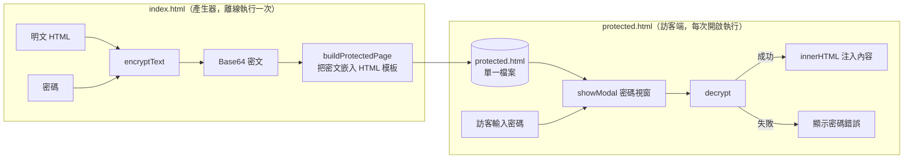
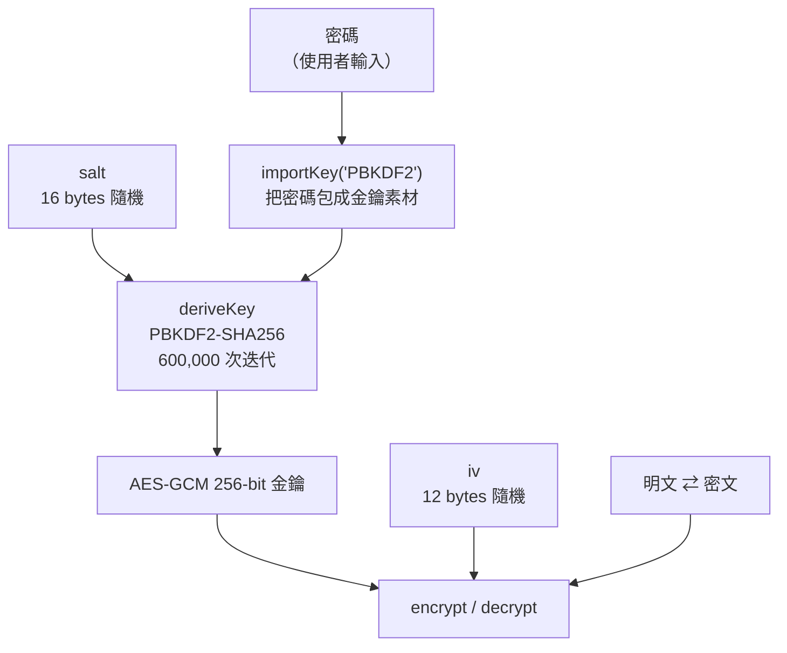

# EncryptPage — 密碼保護網頁產生器

把一段 HTML 內容用密碼加密，產生**單一檔案、純前端**的網頁。訪客打開時會看到密碼輸入視窗，輸入正確密碼才會解密並顯示內容。

不需要後端、不需要資料庫、不需要建置流程，產出的檔案丟到 GitHub Pages 或任何靜態空間就能用。

```
EncryptPage/
├── index.html   ← 產生器（你自己用的工具）
└── README.md
```

產生器會輸出 `protected.html`，那份檔案才是你要拿去部署的成品。

---

## 使用方式

### 1. 開啟產生器

直接用瀏覽器打開 `index.html` 即可（雙擊開啟的 `file://` 也支援）。

若使用 VS Code Live Server 或其他本機伺服器也可以，但請注意網址必須是 `https://`、`localhost` 或 `file://`——Web Crypto API 只在安全內容（secure context）下可用，用區網 IP 的純 `http://` 會失效。

### 2. 填寫三個欄位

| 欄位 | 說明 |
|---|---|
| 頁面標題 | 顯示在密碼輸入畫面上。**不會被加密**，任何人都看得到，別寫敏感資訊。 |
| 要加密的 HTML | 真正要保護的內容。支援 HTML 標籤與 inline `style`。 |
| 密碼 | 需輸入兩次確認，最少 8 字元。 |

### 3. 產生並部署

按「產生加密網頁」後會出現兩個按鈕：

- **下載 protected.html** — 取得成品檔案
- **在新分頁預覽** — 先確認解鎖流程正常再部署

把 `protected.html` 上傳到任何靜態主機即可。成品內含 `<meta name="robots" content="noindex, nofollow">`，避免被搜尋引擎索引。

---

## 實現技術

### 整體架構

產生器與成品頁使用同一套加密格式，但職責相反：前者只加密，後者只解密。



### 密碼學流程

核心是瀏覽器原生的 **Web Crypto API**（`crypto.subtle`），完全沒有第三方函式庫。



**為什麼要 PBKDF2？** 使用者的密碼是低熵字串，不能直接當 AES 金鑰。PBKDF2 把它拉長成 256-bit 金鑰，並刻意讓這個過程很慢（60 萬次迭代），使暴力破解的每一次嘗試都付出同樣代價。迭代次數採用 OWASP 對 PBKDF2-SHA256 的建議值。

**為什麼選 AES-GCM？** GCM 是 AEAD 模式，密文自帶 authentication tag。這帶來一個重要好處——**頁面裡不需要存任何密碼雜湊**。密碼錯誤時 tag 驗證失敗，`crypto.subtle.decrypt` 會直接 reject：

```js
try {
  content.innerHTML = await decrypt(input.value);
  gate.close();
} catch (err) {
  error.hidden = false;   // 解密失敗 = 密碼錯誤
}
```

若改用 CBC 之類的模式，就得額外存一份密碼雜湊來驗證，反而多洩漏一個可離線攻擊的目標。

### 密文封包格式

salt 與 IV 每次加密都重新隨機產生，並且**不需要保密**——它們的作用是確保相同的密碼與內容每次都產生不同密文，直接跟密文一起存在頁面裡即可。

三段資料串接後整包做 Base64：

```
┌──────────────┬──────────────┬─────────────────────────┐
│  salt        │  iv          │  ciphertext + tag       │
│  16 bytes    │  12 bytes    │  變動長度               │
└──────────────┴──────────────┴─────────────────────────┘
        └──────────────── base64() ────────────────┘
```

解密端用固定的位移切回三段：

```js
var packed     = base64ToBytes(PAYLOAD);
var salt       = packed.slice(0, 16);
var iv         = packed.slice(16, 28);
var ciphertext = packed.slice(28);
```

### 前端實作細節

**原生 `<dialog>` 作為鎖定畫面。** 用 `showModal()` 而非 `show()`，可免費得到焦點陷阱、背景變暗與 `::backdrop` 樣式。另外攔截 `cancel` 事件擋掉 Esc 鍵——沒有密碼就沒有內容可看，讓使用者關掉視窗只會得到一片空白：

```js
gate.addEventListener('cancel', function (event) { event.preventDefault(); });
```

密碼欄位標上 `autocomplete="current-password"`，讓瀏覽器與密碼管理員能正常運作。

**避免 UI 凍結。** 60 萬次 PBKDF2 迭代在行動裝置上會佔用主執行緒約一秒。送出後先切換按鈕狀態為「解密中…」，再讓出一次事件迴圈讓瀏覽器把畫面畫出來，然後才開始運算：

```js
submit.textContent = '解密中…';
await new Promise(function (resolve) { setTimeout(resolve, 30); });
```

---

## ⚠️ 維護時的陷阱：模板中的結尾標籤

`buildProtectedPage()` 內是一個樣板字串，字串內容本身就是一整份 HTML。裡面所有結尾標籤都**必須保持跳脫寫法**：

```js
<\/script>
<\/body>
<\/html>
```

反斜線在 JS 樣板字串中會被忽略（`\/` 求值後就是 `/`），所以產出的檔案內容完全正確。但原始碼裡不出現這些位元組序列，可以擋掉兩類問題：

1. **HTML 剖析器提早關閉 script** — 未跳脫的 `</script>` 會直接終止外層的 `<script>` 區塊。
2. **開發伺服器注入到字串中間** — VS Code Live Server 會把自動重載程式碼插在它找到的**第一個** `</body>` 之前。若模板裡有未跳脫的 `</body>`，那個「第一個」就會落在樣板字串內部，注入的程式碼連同它自己的 `</script>` 一起被塞進來，整份 JavaScript 就會以純文字渲染在頁面上。

若日後有人「順手」把跳脫拿掉，頁面下半部會出現一大片 JavaScript 原始碼，console 顯示 `Unexpected end of input`。

---

## 安全性界線

這是**真加密**，不是把內容藏起來的視覺遮蔽——沒有密碼就真的解不開。但它有一個本質限制：

> 密文與解密程式碼**全部都在攻擊者手上**。他可以下載整份檔案，離線無限次嘗試破解，沒有「密碼錯三次鎖定」這種伺服器端防線。

因此 **安全強度完全取決於密碼強度**。弱密碼（生日、`1234`、常見單字）等於沒加密。建議使用 4 個以上不相關的隨機單詞，或 16 字元以上的隨機密碼。

| 適合 | 不適合 |
|---|---|
| 私人筆記、草稿 | 個資、身分證號 |
| 活動邀請函、婚禮資訊 | API 金鑰、密碼、憑證 |
| 不想被搜尋引擎索引的內容 | 商業機密、財務資料 |
| 分享給特定朋友的頁面 | 任何需要稽核或存取控制的場景 |

另外要知道的幾點：

- **內容解密後就存在於 DOM**，使用者可自由複製、存檔、檢視原始碼。這無法做 DRM。
- **頁面標題不加密**，它在鎖定畫面上是明文。
- **內容中的 `<script>` 不會執行**，因為是用 `innerHTML` 注入。HTML 標籤與 inline `style` 都正常運作。

---

## 瀏覽器需求

| 需求 | 說明 |
|---|---|
| Web Crypto API | 需安全內容：`https://`、`localhost` 或 `file://` |
| `<dialog>` + `showModal()` | Baseline widely available |
| 安全內容限制 | 用區網 IP 的純 `http://` 存取會導致 `crypto.subtle` 為 `undefined` |

GitHub Pages 本身就是 HTTPS，直接部署沒有問題。
