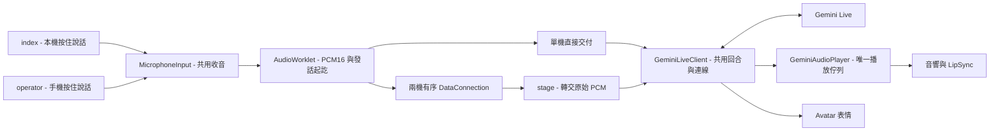
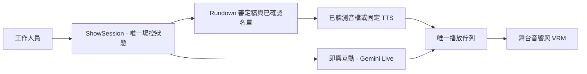

# YearEndParty 語音修復與架構改善 Plan

檢查日期：2026-09-11。範圍：`index.html/app.js`、`operator.html/operator.js`、`stage.html/stage.js` 與語音共用模組。

## 建議與前提

建議保留「操作端手機 + 投影端筆電」的部署方式，集中收音、回合與播放邏輯。若正式活動要求固定聲線與可靠口播，下一階段採用「預定流程用審定稿與預製語音、即興互動用 Gemini Live」的混合架構。

本次已實作下方 P0 的程式修復。P1–P3 是後續 plan，尚未實作。

- 假設目前仍以靜態網站、單一操作端、同一個 VRM 角色為主。
- 本次保留 `gemini-3.1-flash-live-preview`，不把更換模型當作修復。
- 這次能確認的是程式層的截音、丟音與過期訊息問題。沒有使用現場錄音或真實 Gemini session 做辨識正確率與聲線聽測，因此不能宣稱所有語意誤判、重複說話或聲線漂移已解決。

## 1. 問題確認

| 使用者現象 | 程式證據／重現方式 | 判斷與本次處理 |
| --- | --- | --- |
| 主持詞突然中斷 | 舊版兩個頁面的表情 tool 事件都呼叫 `audioPlayer.stop()`，即使正在播有效語音 | 已重現並修復：表情只改 Avatar，不清空播放佇列 |
| 一段語音不見 | 舊 `shouldPlayLiveAudio` 丟棄與 tool call 同封訊息的音訊 | 已重現並修復：有效 PCM 照順序播放，tool response 另行處理 |
| 重連後混入舊語音 | `raw.text()` 等待期間 socket 被替換，解碼後未再次檢查來源 | 已重現並修復：序列化訊息解析，解碼後檢查 socket；不重送離線 PCM |
| 手機說完整句，Gemini 收到的卻不完整 | `ptt:false` 走 data channel，音訊走另一條 MediaStream；投影端提早停止轉送尚在 jitter buffer 的句尾 | 已重現並修復：在手機產生 PCM，開始／音訊／結束共用同一條有序通道 |
| 手機與單機收音落差 | 舊手機端明確關閉 AEC／NS／AGC，單機則要求啟用；手機音訊還經 Opus 與投影端再次擷取 | 已統一實作：相同收音 constraints、AudioWorklet 與 16 kHz PCM。改善幅度仍需實機 A/B |
| 網路抖動時斷續 | 舊播放器起播餘裕僅 25 ms，每包都以當下時間再加 25 ms 排程 | 新增 120 ms 起播緩衝，連續 chunk 依前包結束時間銜接；確定性排程測試通過。更長的停頓仍可能造成 underrun |
| 收到伺服器換線預告就斷句 | 舊版收到 `goAway` 立即關 WebSocket | 改為等待收音、模型回合、實際播放都結束再關線；伺服器期限先到時仍可能被動斷線 |
| 人物聲音改變 | 程式未發現每句隨機更換 voice，但舊設定為空時會省略 voice；兩個頁面的設定各自保存 | 現在固定本次 session 的設定快照，空 voice 回退 Aoede。這不能保證生成模型的音色與韻律完全固定 |

Gemini 3.1 Flash Live 目前只支援同步 function calling；不能直接把表情工具改成 `NON_BLOCKING` 當作修復。同步工具需回傳結果，但官方未要求因此丟棄已收到的有效音訊。[官方工具文件](https://ai.google.dev/gemini-api/docs/live-api/tools)

## 2. 本次修復後的資料流



兩種模式擇一啟動。雙機模式仍然只有 stage 連 Gemini 並播放聲音。

| Module／檔案 | Interface 與用途 |
| --- | --- |
| `microphone.js` | `start(onMessage)`、`begin()`、`end()`、`stop()`；封裝權限、收音設定、AudioContext 與生命週期 |
| `pcm-capture.worklet.js` | 在音訊執行緒處理起訖與跨 block 取樣；每 20 ms 送一包，放開先 flush 不足一包的句尾 |
| `live-session.js` | `start`、`disconnect`、`activityStart/End`、`sendAudio`、`sendText`；封裝 Gemini 回合、工具與重連 |
| `audio-player.js` | `enqueue`、`stop`、`ensureContext`、`getAnalyser`；封裝排程、清空與嘴型所需分析器 |
| `host-config.js` | 共用模型與系統提示詞，避免單機、投影端人設定義漂移 |
| `webrtc-link.js` | 共用房號、ICE 設定、Rundown 與訊息契約 |
| 三個頁面入口 | 按鈕、畫面與事件接線；VRM／LipSync 原有實作仍留在兩個主持頁面 |

這些模組把原先分散在兩個頁面的複雜行為收進小型 Interface；本機與遠端輸入是兩個實際存在的 Adapter，測試也能從同一個 Seam 驗證資料是否完整送達。

收音使用 mono、16 kHz、little-endian PCM16，每個完整 frame 為 640 bytes；每秒純 PCM 約 32 KB，不含傳輸封裝。相較 Opus 會使用更多頻寬，有序可靠傳輸在丟包時也可能增加延遲。操作端會在傳送佇列過大時離線提示重說，避免無限制累積音訊。Google 建議即時音訊使用 20–40 ms chunk，並把麥克風輸入轉為 16 kHz。[官方串流建議](https://ai.google.dev/gemini-api/docs/live-api/best-practices)

PeerJS 1.5.4 的 `reliable:true` 會設定 RTCDataChannel 為 ordered；目前只傳文字控制與 Uint8Array，不傳 Blob，避免另行非同步讀取造成時序不確定。[PeerJS 1.5.4 實作](https://github.com/peers/peerjs/blob/v1.5.4/lib/negotiator.ts)

## 3. 架構方案比較

| 方案 | 適合情境 | 優點 | 代價／限制 |
| --- | --- | --- | --- |
| A：維持 Live，集中共用模組 | 彩排、自由對談、低延遲互動 | 變動小，保留音訊語意與自然互動 | 模型同時決定內容與聲音，口播與聲線難以完全控制 |
| B：預定流程與即興互動分流（建議） | 正式尾牙，有 Rundown、重要人名與獎項 | 預製口播可事先聽測；即興互動保有 Live 能力 | 必須有唯一播放仲裁與模式切換規則，禁止兩路同時出聲 |
| C：STT → 文字生成 → 固定 TTS | 每句都要確認文字、稽核或統一發聲設定 | 內容與語音可分別驗證，工具不干擾發聲 | 步驟更多、延遲與成本需量測，語氣和即時打斷要另外設計 |

不建議此刻全面換成 C：目前已確認的缺陷在客戶端音訊時序，先修 A 才能建立公平比較的基線。若核心需求是「全場聲音都要完全一致」，B 的重要台詞應使用已驗收的預製音檔；只固定 TTS voice 名稱仍不等於逐次生成完全相同的聲音。

## 4. 後續實作順序與驗收

### P0：修復與建立基線（本次已實作）

- [x] 集中 Gemini、播放、提示詞與收音模組。
- [x] 表情不停止語音；隔離過期連線訊息；不重播離線 PCM。
- [x] 手機、本機共用 AudioWorklet，起訖與 PCM 有序交付。
- [x] 手機以 Gemini ready 狀態啟用控制項，顯示輸入／輸出逐字稿。
- [x] 補上錄音中失焦／頁面隱藏時放開，以及重連狀態處理。
- [x] 15 項確定性回歸測試通過；原本 7 個失敗案例轉綠。
- [x] Edge headless 瀏覽器檢查通過：真實 AudioWorklet／虛擬麥克風、24 包有序 PCM、放開、ready 狀態、逐字稿與離線。
- [ ] 真實手機、會場噪音與 Gemini A/B 聽測，見第 5 節。

### P1：統一主持狀態與回合仲裁

新增 `ShowSession` Module，讓 index 與 stage 只處理 UI。Interface 僅暴露開始／停止、提交指令、訂閱狀態；內部持有「已配對、Gemini ready、正在收音、等待回覆、正在播放、重連中」狀態。

工作項目：

1. 對文字、PTT、Rundown 建立同一個指令入口，明確區分排隊、取代、緊急停止；現在文字與語音仍有不同的接線。
2. 引入 `sessionEpoch`、`turnId`、`commandId`、`sequence`，拒絕舊操作端／舊回合訊息；重要指令須收到 ack 才更新 UI。
3. 將目前環節與工作人員提供的事實保留成狀態快照。無法恢復原 session 時，重新提供快照；不自動重播已經口播過的指令。
4. 增加有限的診斷資料：樣本數、輸入秒數、首包等待時間、播放 underrun、重連原因與目前 voice。預設不記錄原始音訊或 API key。

驗收：快速連按、PTT 與切環節交錯、換操作端、重連時，任一時刻最多一個輸入回合與一個播放來源；一筆 command 最多執行一次；單機與兩機相同輸入產生相同 Gemini 訊息序列。

### P2：導入正式活動的混合主持模式



工作項目：開場／頒獎／收尾提供審定稿與預聽；姓名、獎項、得獎結果從工作人員已確認資料填入。固定口播期間先暫停 Live 輸出，完成後才開放即興互動。提供立即停止與預製備援台詞。

驗收：在 Gemini 中斷時仍能播出重要環節；所有重要姓名與獎項逐項對稿；預製音檔與 Live 不重疊；固定台詞多次播放內容及音色相同。是否接受兩路的聲音差異需經現場聽測；若不接受，再評估 C。

### P3：會場連線與 session 韌性

工作項目：在實際 Wi-Fi 驗證 ICE／TURN；現有 `ICE_SERVERS` 只有 STUN，不能假設自動有 TURN。需要時加入可用的 TURN；金鑰與短效 token 改由最小後端處理；CDN 資產視部署需求改成可固定版本且可預載的來源。

Live 的 connection 會有生命週期限制，context compression 不等於永不斷線。需要測試 resumption handle、GoAway 倒數、模型回覆中硬斷線、重新整理後的狀態恢復。已播放內容不可僅憑「最後收到的文字」自動重播。[官方 session 管理](https://ai.google.dev/gemini-api/docs/live-api/session-management)

驗收：至少跑完整個預計活動長度；包含網路切換、手機鎖屏、Gemini 換線與一段斷網，狀態可解釋、操作可恢復、重要指令不重複執行。

## 5. 驗證方式與上場門檻

在 repo 根目錄執行：

```powershell
node --test YearEndParty/tests/host-regressions.test.mjs
node YearEndParty/tests/browser-smoke.mjs
```

第一個測試涵蓋真實頁面事件接線與共用模組，使用模擬 Gemini 訊息；第二個使用本機 Edge 的實際 Web Audio／AudioWorklet 與虛擬麥克風，模擬 PeerJS 配對。兩者都不需要 API key，也不代表已驗證 Gemini 語意品質、PeerJS 公用訊號端或真實跨裝置網路。

實機 A/B：

1. 固定模型、voice、人設、麥克風距離；確認 index 與 stage 的已存設定一致（兩頁仍有不同的 localStorage key）。
2. 準備至少 20 句相同台詞，涵蓋人名、數字、獎項及否定句，例如「先不要抽獎，請先介紹頒獎人」。在安靜與背景音樂環境各跑一輪。
3. 分別記錄 Gemini 輸入逐字稿、任務理解是否正確、放開到首聲的延遲、斷句／重複／聲線變化。輸入逐字稿只能作為診斷線索，不能完全代表模型內部理解。
4. 關鍵姓名與否定指令需逐項人工確認；若仍有語意風險，正式活動改走 P2 的審定稿。延遲及允許誤差以現場需求設定門檻，再決定是否擴大使用 Live。

## 6. 常見問題

**是否只要調 prompt 就能修？** 不能。表情 tool 清空播放、兩條通道不同步、舊 socket 訊息混入都是程式時序問題，見 `live-session.js` 與 `pcm-capture.worklet.js`。

**為什麼不用放開後多等固定 300 ms？** 固定延遲不能保證涵蓋所有網路 jitter；本次在收音處定義起訖，將最後一包 PCM 排在結束訊號前，見 `microphone.js` 與 `operator.js`。

**是否已保證聲線不再改變？** 尚未。`live-session.js` 固定 voice 設定並讀取輸出 PCM 的 sample rate，但模型生成音色的穩定性仍需要真實聽測。要求完全一致的重複口播時，使用已驗收音檔最可驗證。

**更新時需做什麼？** 同時部署 YearEndParty 的新模組與三個入口，並重新整理操作端、投影端。新版本已改傳 PCM data messages，不能讓舊 MediaStream 操作端與新版投影端混用。
