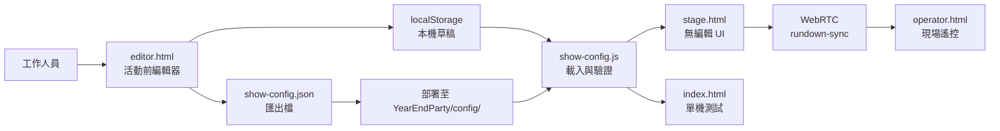
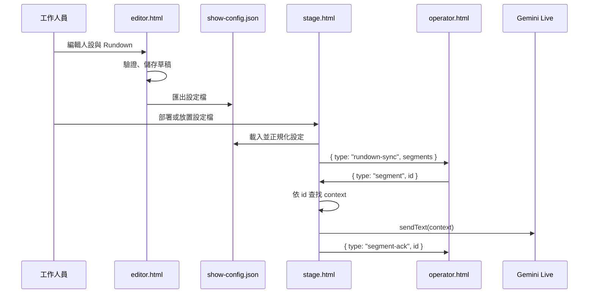

# YearEndParty 編輯工具實作計畫

## 1. 需求結論

技術上可行，且不需要在 `stage.html` 或 `operator.html` 放置編輯介面。

本方案將新增獨立的活動前編輯頁面 `editor.html`，由工作人員在活動前完成主持人設定與 Rundown 編輯，再產生一份活動設定檔。活動進行時：

- `stage.html` 只負責載入設定、連線 Gemini、播放 Avatar。
- `operator.html` 只負責現場遙控，不提供設定或編輯功能。
- WebRTC 只同步已載入的 Rundown，讓手機按鈕與 stage 使用同一份資料。
- API key、WebRTC 設定與固定安全規則不放入可編輯活動設定檔。

## 2. 目前程式的限制

目前有兩類資料被寫死在程式內：

| 資料 | 目前位置 | 目前行為 | 問題 |
| --- | --- | --- | --- |
| 固定主持規則與預設人設 | `host-config.js` | 建立 Gemini system instruction；人設欄位可由 stage 設定，但下次連線才生效 | 活動前沒有獨立編輯及匯出流程 |
| Rundown 環節 | `webrtc-link.js` 的 `SEGMENTS` | operator 依清單畫按鈕，stage 依 `id` 查找 `context` | 只能改原始碼，無法由工作人員管理 |

目前 operator 送出的訊息只有環節 `id`：

```js
{ type: "segment", id: "lucky_draw" }
```

因此設定檔應由 stage 載入並作為執行期的唯一來源；operator 不應自行保存另一份活動流程。

## 3. 建議的模組與檔案配置

```text
YearEndParty/
├── editor.html              # 活動前編輯頁，不參與現場流程
├── editor.js                # 編輯器 UI、驗證、匯入匯出
├── editor.css               # 編輯器專用樣式
├── show-config.js           # 設定格式、預設值、正規化與載入
├── config/
│   └── show-config.json     # 活動前產生並部署的設定檔
├── host-config.js           # 固定主持規則與 Gemini 設定組合
└── webrtc-link.js           # 房號、ICE 與訊息協定；不再持有活動資料
```

`show-config.js` 是新的設定 seam，提供小而穩定的 Interface，將編輯器、stage、單機測試模式與測試隔離開來。資料格式的變化集中在這個 Module，避免三個頁面各自處理 JSON。

建議 Interface：

```js
loadShowConfig({ fetchImpl, storage, url })
saveDraft(config, storage)
normalizeShowConfig(raw)
exportShowConfig(config)
resolveSegment(config, id)
```

## 4. 活動設定格式

第一版只開放真正需要活動前調整的內容：主持人個性與 Rundown。不要把 API key 放進設定檔。

```json
{
  "schemaVersion": 1,
  "host": {
    "userSystemPrompt": "活潑、親切，適時與台下互動，正式環境仍保持得體。"
  },
  "segments": [
    {
      "id": "opening",
      "label": "開場",
      "context": "現在進入開場，請歡迎大家並簡短介紹今天活動。"
    },
    {
      "id": "lucky_draw",
      "label": "抽獎",
      "context": "現在進入抽獎，請營造懸念；得獎名單由工作人員另外提供。"
    }
  ]
}
```

### 可編輯欄位

- `host.userSystemPrompt`
- `segments[].id`
- `segments[].label`
- `segments[].context`
- `segments` 順序

### 不開放編輯的內容

- `REQUIRED_SYSTEM_PROMPT`
- 工具名稱與工具參數規則
- Gemini model、WebRTC ICE 設定
- API key
- 音訊與 WebRTC 訊息格式

`host-config.js` 應維持固定規則，將活動前的人設文字插入固定規則之前或明確的自訂區段，並確保固定規則仍由程式最後組合。這可以避免編輯內容覆蓋「不可自行切換環節」或「不可編造名單」等必要限制。

## 5. 設定檔載入策略

建議使用以下優先順序：

1. 載入部署後的 `config/show-config.json`。
2. 若檔案不存在，讀取同源 `localStorage` 草稿，方便活動前在同一台筆電測試。
3. 若兩者都不存在或格式錯誤，使用程式內建預設值。

編輯器的「儲存」只保存草稿；「匯出」才產生正式 `show-config.json`。工作人員將該檔案放入 `YearEndParty/config/` 後再部署，活動設定即可固定且可追溯。



## 6. 現場資料流

Stage 啟動或手機連線成功後，stage 將目前設定中的 Rundown 傳給 operator。Operator 只保存記憶體中的顯示資料，不負責修改設定檔。



建議新增的訊息：

```js
// stage → operator
{
  type: "rundown-sync",
  schemaVersion: 1,
  segments: [...],
  currentId: ""
}
```

既有的 `segment` 與 `segment-ack` 訊息可以保留。Operator 仍只傳 `id`，不要把 `context` 從手機傳回 stage，避免兩端資料不一致。

## 7. Editor 功能範圍

### 第一版必須具備

- 編輯主持人個性文字
- 新增、修改、刪除 Rundown
- 上下移動環節順序
- 即時顯示 `label` 與 `context` 預覽
- 儲存本機草稿
- 匯入既有 JSON
- 匯出 `show-config.json`
- 還原內建預設值
- 顯示 schema 版本與最後修改時間

### 驗證規則

- `schemaVersion` 必須是支援的版本。
- `id` 只能包含英數字、底線與連字號，且不可重複。
- `label` 不可為空，設定合理的長度上限。
- `context` 不可為空，設定合理的長度上限。
- 至少保留一個 Rundown 環節。
- 匯出內容不得包含 API key 或其他 stage-only 設定。
- UI 顯示使用 `textContent`，不使用 `innerHTML` 插入工作人員輸入內容。

## 8. `host-config.js` 的調整方式

目前 `buildSystemInstruction(userSystemPrompt)` 仍可保留，但呼叫端改成使用載入後的活動設定：

```js
const config = await loadShowConfig();
gemini.start({
  ...runtimeSettings,
  userSystemPrompt: config.host.userSystemPrompt,
});
```

主持人設定的生效時機定義如下：

- 活動前修改並重新載入 stage：下一次 Gemini session 使用新設定。
- 活動中修改檔案：不自動套用，也不重建目前 session。
- 若需套用新設定，工作人員在活動空檔手動重新開始 Gemini session。

Rundown 則不同：stage 載入新設定後，下一次按下環節按鈕即可使用新 `context`；已經送出的指令不追溯修改。

## 9. 實作順序

### P0：抽離設定資料

- 將 `SEGMENTS` 的資料移至 `show-config.js` 的預設設定。
- 建立 `normalizeShowConfig()`、`resolveSegment()`。
- `host-config.js` 保留固定主持規則。
- `webrtc-link.js` 僅保留連線設定與訊息契約。

### P1：建立獨立 Editor

- 新增 `editor.html`、`editor.js`、`editor.css`。
- 完成 Rundown CRUD、排序、驗證、匯入匯出。
- 加入人設文字編輯，但不顯示固定 system prompt。

### P2：整合 stage 與單機模式

- stage 啟動時載入活動設定。
- index 載入同一份設定，維持單機測試與正式流程一致。
- Gemini session 使用設定中的人設文字。

### P3：同步 operator

- stage 配對成功後傳送 `rundown-sync`。
- operator 收到同步資料後動態建立按鈕。
- 自訂環節可正常送出、套用與回傳 ack。
- 舊設定檔或同步失敗時使用內建預設值並顯示警告。

## 10. 驗收條件

- 工作人員不修改 JavaScript，即可新增、刪除、排序及修改環節。
- 編輯器可匯出設定檔，重新整理後內容仍可載入。
- stage 頁面沒有編輯工具或額外管理流程。
- operator 只顯示目前活動設定的遙控按鈕，不提供編輯功能。
- 手機收到 `rundown-sync` 後能顯示自訂環節。
- 點擊自訂環節後，stage 使用正確的 `context` 傳給 Gemini。
- stage 與 operator 的既有 PTT、逐字稿、ack 與斷線行為不受影響。
- 設定檔錯誤時不會造成 API key 外洩或執行任意腳本。
- 測試涵蓋預設設定、匯入匯出、錯誤驗證、同步、自訂環節與舊版 fallback。

## 11. 最終建議

採用「獨立 Editor + 靜態 JSON 設定檔 + stage 載入 + WebRTC 同步」的方案。這符合手機端只做現場遙控的需求，也讓活動設定可以在活動前被檢查、備份與固定版本。

不要讓 editor 直接修改 `host-config.js` 或 `webrtc-link.js`；瀏覽器無法安全地直接改寫部署中的 JavaScript，且會使程式碼與活動資料互相耦合。將硬編碼內容降級為預設值，將實際活動資料移到可驗證的 `show-config.json`，可以得到較好的可維護性與操作安全性。
